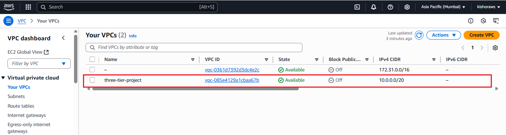
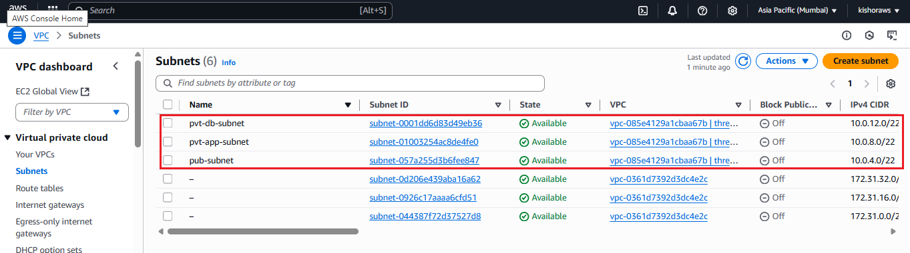
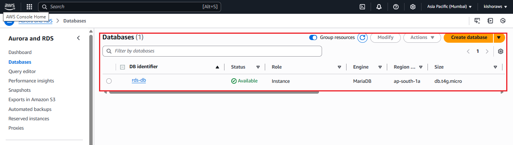

# Secure Java Web Application – 3-Tier Architecture on AWS (VPC Based)

This project demonstrates the deployment of a Java-based Student Management Web Application using a secure 3-tier architecture on AWS. The architecture consists of a Proxy Server (NGINX), App Server (Tomcat), and DB Server (MySQL RDS), deployed inside a custom VPC setup.

---

## 📦 Application Features

- Manage student records via web interface
- Add, update, delete, and list students
- Java backend using `student.war`
- Tomcat server to host the WAR
- MySQL database for persistent storage (RDS)
- Secure network design using AWS VPC

---

## 🌐 Architecture Overview

- **VPC** with 3 Subnets: 1 public, 2 private
- **1 Internet Gateway** for public access
- **1 NAT Gateway** for private instances to access the internet
- **Public Route Table** attached to public subnet
- **Private Route Table** attached to private subnets
- **Instances:**
  - Proxy Server (NGINX) – Public Subnet
  - App Server (Tomcat) – Private Subnet
  - DB Server (MySQL RDS) – Private Subnet

---

## ✅ Step-by-Step Deployment

### ✅ Step 1: Create VPC and Subnets

- Create VPC with CIDR block `10.0.0.0/16`

---
- Create 1 Public Subnet and 2 Private Subnets in different AZs

---
- Enable Auto-assign Public IP for public subnet

### ✅ Step 2: Configure Internet Gateway and Route Tables

- Attach Internet Gateway (IGW) to VPC

---

- Create Public Route Table → Add route to IGW → Associate with public subnet

---
- Create Private Route Table → Add route to NAT Gateway → Associate with private subnets

---

---

### ✅ Step 3: Launch EC2 Instances

- Launch 3 EC2 instances:
  - `proxy-server` (Amazon Linux 2) – Public Subnet
  - `app-server` (Amazon Linux 2) – Private Subnet
  - `db-server` (use RDS instead of EC2) – Private Subnet
- Use correct key pairs and assign security groups

---

### ✅ Step 4: Create RDS MySQL Instance

- Choose RDS → MySQL
- Set DB instance identifier (e.g. `student-db`)
- Set username and password
- Place inside VPC and private subnet group
- Ensure security group allows access on port `3306` from `app-server`

---

### ✅ Step 5: Install and Configure Apache Tomcat on App Server
      sudo yum update -y
      sudo yum install java-1.8.0-openjdk -y
      cd /opt
      sudo wget https://dlcdn.apache.org/tomcat/tomcat-9/v9.0.85/bin/apache-tomcat-9.0.85.tar.gz
      sudo tar -xvzf apache-tomcat-9.0.85.tar.gz
      sudo mv apache-tomcat-9.0.85 tomcat
      cd /opt/tomcat/bin
      sudo chmod +x *.sh
      ./startup.sh

## ✅ Step 6: Deploy `student.war` to Tomcat
      sudo cp student.war /opt/tomcat/webapps/
      cd /opt/tomcat/bin
      ./shutdown.sh
      ./startup.sh

## ✅ Step 7: Download and Add MySQL Connector
      cd /opt/tomcat/lib
      wget https://downloads.mysql.com/archives/get/p/3/file/mysql-connector-java-8.0.33.tar.gz
      tar -xvzf mysql-connector-java-8.0.33.tar.gz
      cp mysql-connector-java-8.0.33/mysql-connector-java-8.0.33.jar.

### ✅ Step 8: Configure Tomcat's context.xml
- Edit the file: /opt/tomcat/conf/context.xml

      <Resource name="jdbc/studentdb" 
          auth="Container"
          type="javax.sql.DataSource"
          maxTotal="100"
          maxIdle="20"
          maxWaitMillis="-1"
          username="admin"
          password="yourpassword"
          driverClassName="com.mysql.cj.jdbc.Driver"
          url="jdbc:mysql://<rds-endpoint>:3306/studentdb"/>
---

## ✅ Step 9: Configure Proxy Server (NGINX)
      sudo amazon-linux-extras install nginx1 -y
      sudo systemctl enable nginx
      sudo systemctl start nginx
- Edit the file /etc/nginx/nginx.conf and add the following under the http block:
      server {
      listen 80;

      location / {
        proxy_pass http://<app-server-private-ip>:8080/student/;
        proxy_set_header Host $host;
        proxy_set_header X-Real-IP $remote_addr;
        proxy_set_header X-Forwarded-For $proxy_add_x_forwarded_for;
       }
      }
- Replace <app-server-private-ip> with your actual private IP of the app server.
- Restart NGINX : 

      sudo systemctl restart nginx

## ✅ Step 10: Test the Application
- In your browser, visit :

      http://<proxy-server-public-ip>/

Now we should see the Student Management Web Application. Try the following:

- Add a student
- View all students
- Edit and delete student records

---

---
## ✅ Step 11: Verify Database Connection (RDS)
   - Connect to RDS from app server or using a MySQL client:

         mysql -h <rds-endpoint> -u admin -p
         USE studentdb;
         SELECT * FROM student;

- Make sure your security group for RDS allows access from the app server's private IP.

## 📘 Final Project Summary
- Project Title: Secure Java Web App on AWS using 3-Tier VPC Architecture

### Components:

- Java backend using WAR file
- Apache Tomcat as App Server
- Amazon RDS (MySQL) as DB Server
- NGINX on Proxy Server

### Infrastructure:

-  VPC with 1 Public Subnet and 2 Private Subnets
- Internet Gateway for public access
- NAT Gateway for private subnet outbound access
- 3 EC2 Instances (Proxy, App, DB/RDS)

### Security:

- Access managed via Security Groups
- Public only for NGINX
- Private for App and RDS

### Goal:

- Secure and scalable deployment of a Java web app with persistent storage and modular design
---

## 🙋‍♂️ Author

- Deployed and configured by **Kishor Borse**  
- This project reflects a complete hands-on implementation of AWS services for a secure 3-tier Java web application setup.

---

## 🙏 Thank You

- Thanks for reviewing this deployment project.  
- This project showcases how to practically implement a secure VPC-based 3-tier architecture using AWS services like EC2, RDS, NGINX, Tomcat, and MySQL.  
Hope this helps others build production-ready applications on the cloud with confidence.
